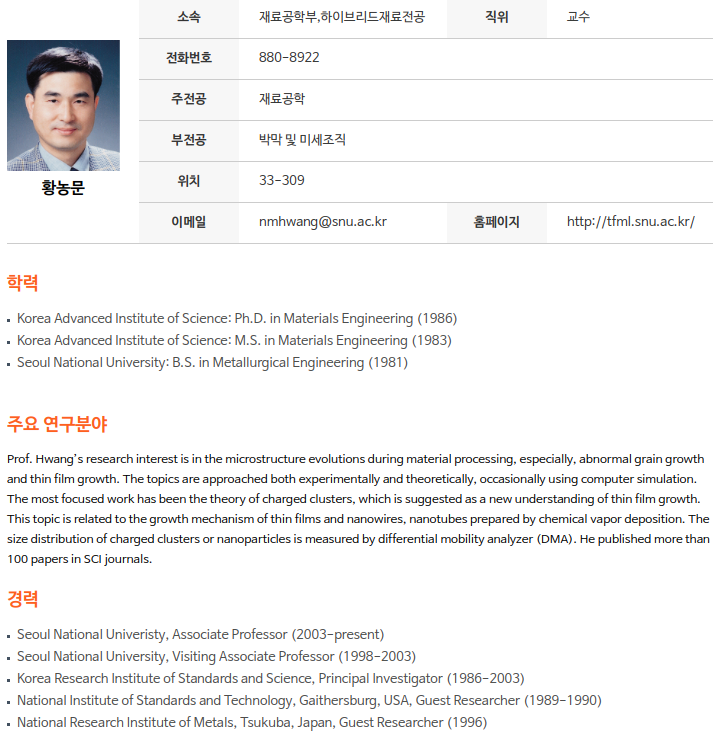
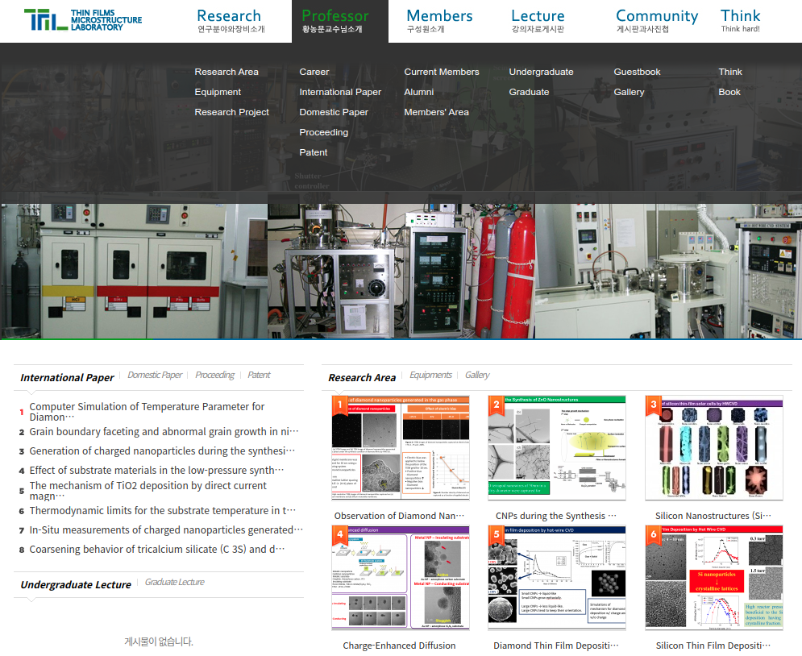
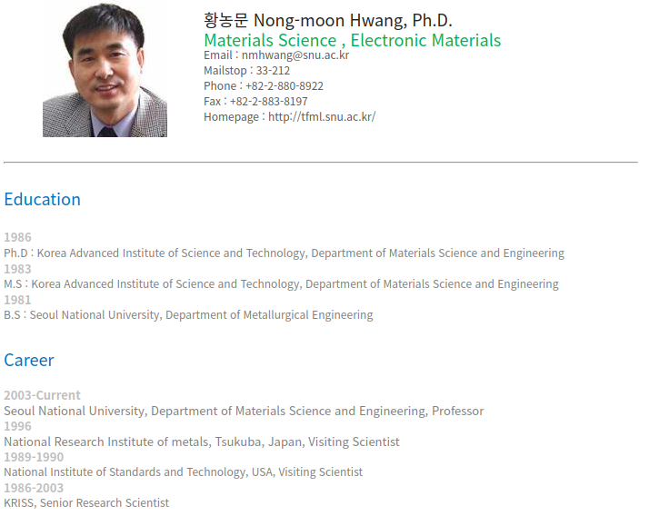
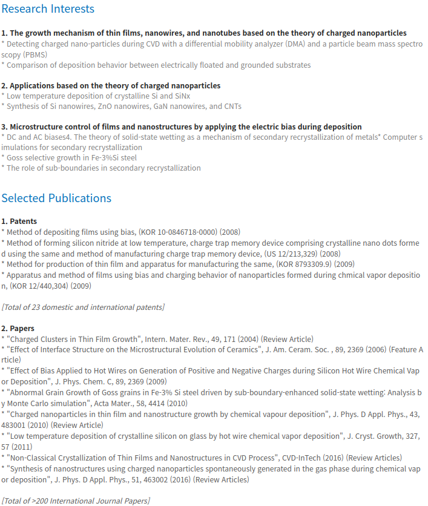
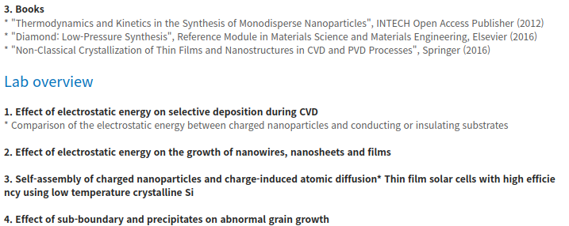

##### aimldl/documents/zzz/inspiration/02-Nong-moon_Hwang.md

## Prof. Nong-Moon Hwang

2019-12-18 (Wed)
용기를 내서 검색해봤다. 황농문 교수님의 메일주소는 비교적 쉽게 알 수 있었지만, 메일의 내용을 채우는 데서 주저했다. 메일의 내용을 쓰는 것은 다시 용기를 내보기로 한다. 그래도 1년 넘게 미뤄왔던 것의 첫 번째 스텝을 띄게 되었다.

### Prof. Hwang

Naver Search: 서울대 황농문 교수
* [황농문 | SNU 서울대학교 공과대학](https://eng.snu.ac.kr/node/8186)

* [TFMLab](http://tfml.snu.ac.kr/)

  * [Professor 황농문 교수님 소개](http://tfml.snu.ac.kr/board/bbs/board.php?bo_table=b1&wr_id=1)

### Mass Media
[이현덕이 만난 생각의 리더(128) '몰입 전문가' 황농문 서울대 교수](https://iton.tistory.com/2250)

