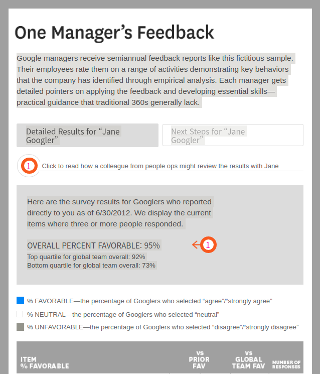
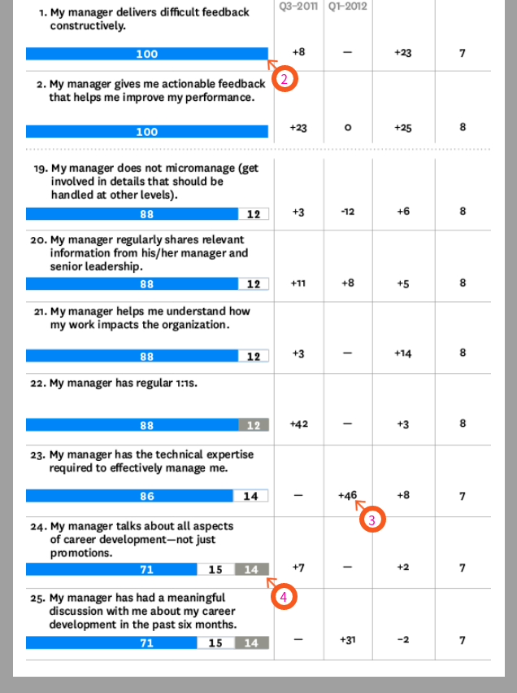

This article is from https://hbr.org/2013/12/how-google-sold-its-engineers-on-management

[Leadership Development](https://hbr.org/topic/leadership-development)

# [How Google Sold Its Engineers on Management](https://hbr.org/2013/12/how-google-sold-its-engineers-on-management)

by [David A. Garvin](https://hbr.org/search?term=david a. garvin)

From the Magazine (December 2013), Harvard Business Review

A version of this article appeared in the [December 2013](https://hbr.org/archive-toc/BR1312) issue of *Harvard Business Review*.

[David A. Garvin](https://hbr.org/search?term=david a. garvin&search_type=search-all) was the C. Roland Christensen Professor at Harvard Business School.

**Summary.**  High-performing knowledge workers often question whether managers actually contribute much, especially in a technical environment. Until recently, that was the case at Google, a company filled with self-starters who viewed management as more destructive than beneficial and as a distraction from “real work.” But when Google’s people analytics team examined the value of managers, applying the same rigorous research methods the company uses in its operations, it proved the skeptics wrong.Mining data from employee surveys, performance reviews, and double-blind interviews, the team verified that managers indeed had a positive impact. It also pinpointed exactly how, identifying the eight key behaviors of great Google managers.In this article, Harvard Business School professor Garvin describes how Google has incorporated the detailed findings from the research into highly specific, concrete guidelines; classes; and feedback reports that help managers hone their essential skills. Because these tools were built from the ground up, using the staff’s own input, they’ve been embraced by Google employees. Managers say that they’ve found their training to be invaluable, and managers’ ratings from direct reports have steadily risen across the company.

Artwork: Chad Hagen, Graphic Composition No. 1, 2009, digital

Since the early days of Google, people throughout the company have questioned the value of managers. That skepticism stems from a highly technocratic culture. As one software engineer, Eric Flatt, puts it, “We are a company built by engineers for engineers.” And most engineers, not just those at Google, want to spend their time designing and debugging, not communicating with bosses or supervising other workers’ progress. In their hearts they’ve long believed that management is more destructive than beneficial, a distraction from “real work” and tangible, goal-directed tasks.

A few years into the company’s life, founders Larry Page and Sergey Brin actually wondered whether Google needed any managers at all. In 2002 they experimented with a completely flat organization, eliminating engineering managers in an effort to break down barriers to rapid idea development and to replicate the collegial environment they’d enjoyed in graduate school. That experiment lasted only a few months: They relented when too many people went directly to Page with questions about expense reports, interpersonal conflicts, and other nitty-gritty issues. And as the company grew, the founders soon realized that managers contributed in many other, important ways—for instance, by communicating strategy, helping employees prioritize projects, facilitating collaboration, supporting career development, and ensuring that processes and systems aligned with company goals.

Google now has some layers but not as many as you might expect in an organization with more than 37,000 employees: just 5,000 managers, 1,000 directors, and 100 vice presidents. It’s not uncommon to find engineering managers with 30 direct reports. Flatt says that’s by design, to prevent micromanaging. “There is only so much you can meddle when you have 30 people on your team, so you have to focus on creating the best environment for engineers to make things happen,” he notes. Google gives its rank and file room to make decisions and innovate. Along with that freedom comes a greater respect for technical expertise, skillful problem solving, and good ideas than for titles and formal authority. Given the overall indifference to pecking order, anyone making a case for change at the company needs to provide compelling logic and rich supporting data. Seldom do employees accept top-down directives without question.

Google downplays hierarchy and emphasizes the power of the individual in its recruitment efforts, as well, to achieve the right cultural fit. Using a rigorous, data-driven hiring process, the company goes to great lengths to attract young, ambitious self-starters and original thinkers. It screens candidates’ résumés for markers that indicate potential to excel there—especially general cognitive ability. People who make that first cut are then carefully assessed for initiative, flexibility, collaborative spirit, evidence of being well-rounded, and other factors that make a candidate “Googley.”

So here’s the challenge Google faced: If your highly skilled, handpicked hires don’t value management, how can you run the place effectively? How do you turn doubters into believers, persuading them to spend time managing others? As it turns out, by applying the same analytical rigor and tools that you used to hire them in the first place—and that they set such store by in their own work. You use data to test your assumptions about management’s merits and then make your case.

## Analyzing the Soft Stuff

To understand how Google set out to prove managers’ worth, let’s go back to 2006, when Page and Brin brought in Laszlo Bock to head up the human resources function—appropriately called people operations, or people ops. From the start, people ops managed performance reviews, which included annual 360-degree assessments. It also helped conduct and interpret the Googlegeist employee survey on career development goals, perks, benefits, and company culture. A year later, with that foundation in place, Bock hired Prasad Setty from Capital One to lead a people analytics group. He challenged Setty to approach HR with the same empirical discipline Google applied to its business operations.

Setty took him at his word, recruiting several PhDs with serious research chops. This new team was committed to leading organizational change. “I didn’t want our group to be simply a reporting house,” Setty recalls. “Organizations can get bogged down in all that data. Instead, I wanted us to be hypothesis-driven and help solve company problems and questions with data.”

People analytics then pulled together a small team to tackle issues relating to employee well-being and productivity. In early 2009 it presented its initial set of research questions to Setty. One question stood out, because it had come up again and again since the company’s founding: Do managers matter?

To find the answer, Google launched Project Oxygen, a multiyear research initiative. It has since grown into a comprehensive program that measures key management behaviors and cultivates them through communication and training. By November 2012, employees had widely adopted the program—and the company had shown statistically significant improvements in multiple areas of managerial effectiveness and performance.

Google is one of several companies that are applying analytics in new ways. Until recently, organizations used data-driven decision making mainly in product development, marketing, and pricing. But these days, Google, Procter & Gamble, Harrah’s, and others take that same approach in addressing human resources needs. (See [“Competing on Talent Analytics,” ](https://hbr.org/2010/10/competing-on-talent-analytics/ar/1)by Thomas H. Davenport, Jeanne Harris, and Jeremy Shapiro, HBR October 2010.)

Unfortunately, scholars haven’t done enough to help these organizations understand and improve day-to-day management practice. Compared with leadership, managing remains understudied and undertaught—largely because it’s so difficult to describe, precisely and concretely, what managers actually do. We often say that they get things done through other people, yet we don’t usually spell out how in any detail. Project Oxygen, in contrast, was designed to offer granular, hands-on guidance. It didn’t just identify desirable management traits in the abstract; it pinpointed specific, measurable behaviors that brought those traits to life.

**“Engineers hate being micromanaged on the technical side but love being closely managed on the career side.”**

That’s why Google employees let go of their skepticism and got with the program. Project Oxygen mirrored their decision-making criteria, respected their need for rigorous analysis, and made it a priority to measure impact. Data-driven cultures, Google discovered, respond well to data-driven change.

## Making the Case

Project Oxygen colead Neal Patel recalls, “We knew the team had to be careful. Google has high standards of proof, even for what, at other places, might be considered obvious truths. Simple correlations weren’t going to be enough. So we actually ended up trying to prove the opposite case—that managers don’t matter. Luckily, we failed.”

To begin, Patel and his team reviewed exit-interview data to see if employees cited management issues as a reason for leaving Google. Though they found some connections between turnover rates and low satisfaction with managers, those didn’t apply to the company more broadly, given the low turnover rates overall. Nor did the findings prove that managers caused attrition.

As a next step, Patel examined Googlegeist ratings and semiannual reviews, comparing managers on both satisfaction and performance. For both dimensions, he looked at the highest and lowest scorers (the top and bottom quartiles).

“At first,” he says, “the numbers were not encouraging. Even the low-scoring managers were doing pretty well. How could we find evidence that better management mattered when all managers seemed so similar?” The solution came from applying sophisticated multivariate statistical techniques, which showed that even “the smallest incremental increases in manager quality were quite powerful.”

For example, in 2008, the high-scoring managers saw less turnover on their teams than the others did—and retention was related more strongly to manager quality than to seniority, performance, tenure, or promotions. The data also showed a tight connection between managers’ quality and workers’ happiness: Employees with high-scoring bosses consistently reported greater satisfaction in multiple areas, including innovation, work-life balance, and career development.

In light of this research, the Project Oxygen team concluded that managers indeed mattered. But to act on that finding, Google first had to figure out what its best managers did. So the researchers followed up with double-blind qualitative interviews, asking the high- and low-scoring managers questions such as “How often do you have career development discussions with your direct reports?” and “What do you do to develop a vision for your team?” Managers from Google’s three major functions (engineering, global business, and general and administrative) participated; they came from all levels and geographies. The team also studied thousands of qualitative comments from Googlegeist surveys, performance reviews, and submissions for the company’s Great Manager Award. (Each year, Google selects about 20 managers for this distinction, on the basis of employees’ nominations.) It took several months to code and process all this information.

After much review, Oxygen identified eight behaviors shared by high-scoring managers. (See the sidebar “What Google’s Best Managers Do” for the complete list.) Even though the behaviors weren’t terribly surprising, Patel’s colead, Michelle Donovan, says, “we hoped that the list would resonate because it was based on Google data. The attributes were about us, by us, and for us.”

The key behaviors primarily describe leaders of small and medium-sized groups and teams and are especially relevant to first- and second-level managers. They involve developing and motivating direct reports, as well as communicating strategy and eliminating roadblocks—all vital activities that people tend to overlook in the press of their day-to-day responsibilities.

## Putting the Findings into Practice

The list of behaviors has served three important functions at Google: giving employees a shared vocabulary for discussing management, offering them straightforward guidelines for improving it, and encapsulating the full range of management responsibilities. Though the list is simple and straightforward, it’s enriched by examples and descriptions of best practices—in survey participants’ own words. These details make the overarching principles, such as “empowers the team and does not micromanage,” more concrete and show managers different ways of enacting them. (See the exhibit “How Google Defines One Key Behavior.”)

The descriptions of the eight behaviors also allow considerable tailoring. They’re inclusive guidelines, not rigid formulas. That said, it was clear early on that managers would need help adopting the new standards, so people ops built assessments and a training program around the Oxygen findings.

To improve the odds of acceptance, the group customized the survey instrument, creating an upward feedback survey (UFS) for employees in administrative and global business functions and a tech managers survey (TMS) for the engineers. Both assessments asked employees to evaluate their managers (using a five-point scale) on a core set of activities—such as giving actionable feedback regularly and communicating team goals clearly—all of which related directly to the key management behaviors.

The first surveys went out in June 2010—deliberately out of sync with performance reviews, which took place in April and September. (Google had initially considered linking the scores with performance reviews but decided that would increase resistance to the Oxygen program because employees would view it as a top-down imposition of standards.) People ops emphasized confidentiality and issued frequent reminders that the surveys were strictly for self-improvement. “Project Oxygen was always meant to be a developmental tool, not a performance metric,” says Mary Kate Stimmler, an analyst in the department. “We realized that anonymous surveys are not always fair, and there is often a context behind low scores.”

Though the surveys weren’t mandatory, the vast majority of employees completed them. Soon afterward, managers received reports with numerical scores and individual comments—feedback they were urged to share with their teams. (See the exhibit “One Manager’s Feedback” for a representative sample.) The reports explicitly tied individuals’ scores to the eight behaviors, included links to more information about best practices, and suggested actions each manager could take to improve. Someone with, say, unfavorable scores in coaching might get a recommendation to take a class on how to deliver personalized, balanced feedback.

People ops designed the training to be hands-on and immediately useful. In “vision” classes, for example, participants practiced writing vision statements for their departments or teams and bringing the ideas to life with compelling stories. In 2011, Google added Start Right, a two-hour workshop for new managers, and Manager Flagship courses on popular topics such as managing change, which were offered in three two-day modules over six months. “We have a team of instructors,” says people-development manager Kathrin O’Sullivan, “and we are piloting online Google Hangout classes so managers from around the world can participate.”

Managers have expressed few concerns about signing up for the courses and going public with the changes they need to make. Eric Clayberg, for one, has found his training invaluable. A seasoned software-engineering manager and serial entrepreneur, Clayberg had led teams for 18 years before Google bought his latest start-up. But he feels he learned more about management in six months of Oxygen surveys and people ops courses than in the previous two decades. “For instance,” he says, “I was worried about the flat organizational structure at Google; I knew it would be hard to help people on my team get promoted. I learned in the classes about how to provide career development beyond promotions. I now spend a third to half my time looking for ways to help my team members grow.” And to his surprise, his reports have welcomed his advice. “Engineers hate being micromanaged on the technical side,” he observes, “but they love being closely managed on the career side.”

To complement the training, the development team sets up panel discussions featuring high-scoring managers from each function. That way, employees get advice from colleagues they respect, not just from HR. People ops also sends new managers automated e-mail reminders with tips on how to succeed at Google, links to relevant Oxygen findings, and information about courses they haven’t taken.

And Google rewards the behaviors it’s working so hard to promote. The company has revamped its selection criteria for the Great Manager Award to reflect the eight Oxygen behaviors. Employees refer to the behaviors and cite specific examples when submitting nominations. Clayberg has received the award, and he believes it was largely because of the skills he acquired through his Oxygen training. The prize includes a weeklong trip to a destination such as Hawaii, where winners get to spend time with senior executives. Recipients go places in the company, too. “In the last round of promotions to vice president,” Laszlo Bock says, “10% of the directors promoted were winners of the Great Manager Award.”

## Measuring Results

The people ops team has analyzed Oxygen’s impact by examining aggregate survey data and qualitative input from individuals. From 2010 through 2012, UFS and TMS median favorability scores rose from 83% to 88%. The lowest-scoring managers improved the most, particularly in the areas of coaching and career development. The improvements were consistent across functions, survey categories, management levels, spans of control, and geographic regions.

In an environment of top achievers, people take low scores seriously. Consider vice president Sebastien Marotte, who came to Google in 2011 from a senior sales role at Oracle. During his first six months at Google, Marotte focused on meeting his sales numbers (and did so successfully) while managing a global team of 150 people. Then he received his first UFS scores, which came as a shock. “I asked myself, ‘Am I right for this company? Should I go back to Oracle?’ There seemed to be a disconnect,” he says, “because my manager had rated me favorably in my first performance review, yet my UFS scores were terrible.” Then, with help from a people ops colleague, Marotte took a step back and thought about what changes he could make. He recalls, “We went through all the comments and came up with a plan. I fixed how I communicated with my team and provided more visibility on our long-term strategy. Within two survey cycles, I raised my favorability ratings from 46% to 86%. It’s been tough but very rewarding. I came here as a senior sales guy, but now I feel like a general manager.”

Overall, other managers took the feedback as constructively as Marotte did—and were especially grateful for its specificity. Here’s what Stephanie Davis, director of large-company sales and another winner of the Great Manager Award, says she learned from her first feedback report: “I was surprised that one person on my team didn’t think I had regularly scheduled one-on-one meetings. I saw this person every day, but the survey helped me realize that just seeing this person was different from having regularly scheduled individual meetings. My team also wanted me to spend more time sharing my vision. Personally, I have always been inspired by Eric [Schmidt], Larry, and Sergey; I thought my team was also getting a sense of the company’s vision from them. But this survey gave my team the opportunity to explain that they wanted me to interpret the higher-level vision for them. So I started listening to the company’s earnings call with a different ear. I didn’t just come back to my team with what was said; I also shared what it meant for them.”

Chris Loux, head of global enterprise renewals, remembers feeling frustrated with his low UFS scores. “I had received a performance review indicating that I was exceeding expectations,” he says, “yet one of my direct reports said on the UFS that he would not recommend me as a manager. That struck me, because people don’t quit companies—they quit managers.” At the same time, Loux struggled with the question of just how much to push the lower performers on his team. “It’s hard to give negative feedback to a type-A person who has never received bad feedback in his or her life,” he explains. “If someone gets 95% favorable on the UFS, I wonder if that manager is avoiding problems by not having tough conversations with reports on how they can get better.”

Loux isn’t the only Google executive to speculate about the connection between employees’ performance reviews and their managers’ feedback scores. That question came up multiple times during Oxygen’s rollout. To address it, the people analytics group fell back on a time-tested technique—going back to the data and conducting a formal analysis to determine whether a manager who gave someone a negative performance review would then receive a low feedback rating from that employee. After looking at two quarters’ worth of survey data from 2011, the group found that changes in employee performance ratings (both upward and downward) accounted for less than 1% of variability in corresponding manager ratings across all functions at Google.

“Managing to the test” doesn’t appear to be a big risk, either. Because the eight behaviors are rooted in action, it’s difficult for managers to fake them in pursuit of higher ratings. In the surveys, employees don’t assess their managers’ motivations, values, or beliefs; rather, they evaluate the extent to which their managers demonstrate each behavior. Either the manager has acted in the ways recommended—consistently and credibly—or she has not. There is very little room for grandstanding or dissembling.

“We are not trying to change the nature of people who work at Google,” says Bock. “That would be presumptuous and dangerous. Instead, we are saying, ‘Here are a few things that will lead you to be perceived as a better manager.’ Our managers may not completely believe in the suggestions, but after they act on them and get better UFS and TMS scores, they may eventually internalize the behavior.”

Project Oxygen does have its limits. A commitment to managerial excellence can be hard to maintain over the long haul. One threat to sustainability is “evaluation overload.” The UFS and the TMS depend on employees’ goodwill. Googlers voluntarily respond on a semiannual basis, but they’re asked to complete many other surveys as well. What if they decide that they’re tired of filling out surveys? Will response rates bottom out? Sustainability also depends on the continued effectiveness of managers who excel at the eight behaviors, as well as those behaviors’ relevance to senior executive positions. A disproportionate number of recently promoted vice presidents had won the Great Manager Award, a reflection of how well they’d followed Oxygen’s guidelines. But what if other behaviors—those associated with leadership skills—matter more in senior positions?

Further, while survey scores gauge employees’ satisfaction and perceptions of the work environment, it’s unclear exactly what impact those intangibles have on such bottom-line measures as sales, productivity, and profitability. (Even for Google’s high-powered statisticians, those causal relationships are difficult to establish.) And if the eight behaviors do actually benefit organizational performance, they still might not give Google a lasting edge. Companies with similar competitive profiles—high-tech firms, for example, that are equally data-driven—can mimic Google’s approach, since the eight behaviors aren’t proprietary.

**Because the eight behaviors are rooted in action, it’s difficult for managers to fake them.**

Still, Project Oxygen has accomplished what it set out to do: It not only convinced its skeptical audience of Googlers that managers mattered but also identified, described, and institutionalized their most essential behaviors. Oxygen applied the concept of data-driven continuous improvement directly—and successfully—to the soft skills of management. Widespread adoption has had a significant impact on how employees perceive life at Google—particularly on how they rate the degree of collaboration, the transparency of performance evaluations, and their groups’ commitment to innovation and risk taking. At a company like Google, where the staff consists almost entirely of “A” players, managers have a complex, demanding role to play. They must go beyond overseeing the day-to-day work and support their employees’ personal needs, development, and career planning. That means providing smart, steady feedback to guide people to greater levels of achievement—but intervening judiciously and with a light touch, since high-performing knowledge workers place a premium on autonomy. It’s a delicate balancing act to keep employees happy and motivated through enthusiastic cheerleading while helping them grow through stretch assignments and carefully modulated feedback. When the process works well, it can yield extraordinary results.

That’s why Prasad Setty wants to keep building on Oxygen’s findings about effective management practice. “We will have to start thinking about what else drives people to go from good to great,” he says. His team has begun analyzing managers’ assessment scores by personality type, looking for patterns. “With Project Oxygen, we didn’t have these endogenous variables available to us,” he adds. “Now we can start to tease them out, using more of an ethnographic approach. It’s really about observations—staying with people and studying their interactions. We’re not going to have the capacity to follow tons of people, but what we’ll lose in terms of numbers, we’ll gain in a deeper understanding of what managers and their teams experience.”

That, in a nutshell, is the principle at the heart of Google’s approach: deploying disciplined data collection and rigorous analysis—the tools of science—to uncover deeper insights into the art and craft of management.

