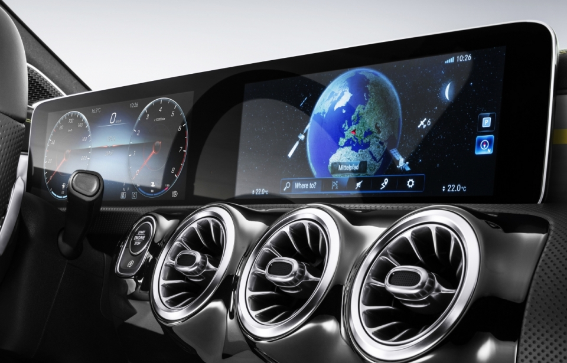
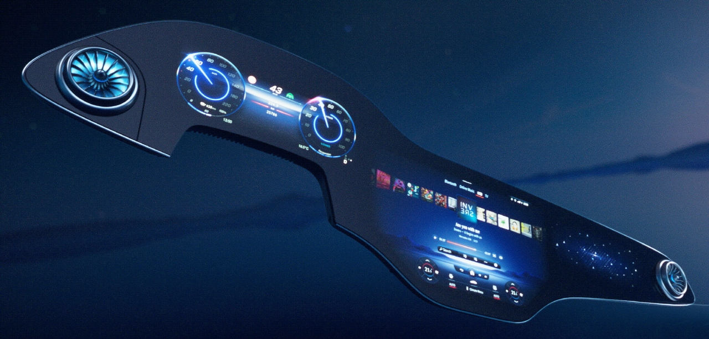

[인포테인먼트 시스템의 진화... 메르세데스-벤츠, AI 기반 'MBUX 하이퍼스크린' 세계 최초 공개](http://www.aitimes.kr/news/articleView.html?idxno=18893), 2021-01-10, AI Times

**1세대 MBUX 화면**

* 2018년 세계 최초로 다임러-벤츠(Daimler-Benz AG)는 AI와 직관적인 운영 체제를 기반으로 완전히 새로운 차세대 인공지능 인포테인먼트 시스템 'MBUX(Mercedes-Benz User Experience)'을 발표

**2세대 MBUX Hyperscreen**

- 메르세데스-벤츠는 더 똑똑해진 인공지능 기반 'MBUX 하이퍼 스크린(Hyperscree)' 지능형 인포테인먼트 시스템을 7일(현지시간) 선보임

  - 새로운 AI인포테인먼트 시스템으로 뉘앙스의 AI 어시스턴트가 탑재
  - ‘제로 레이어(Zero Layer)’ 사용자 인터페이스로 필요한 모든 주행 기능이 터치 한 번으로 제공
  - 즉각적인 AI 처리 및 선명한 그래픽을 위해 고성능의 에너지 효율적인 엔비디아 GPU에서 작동

  