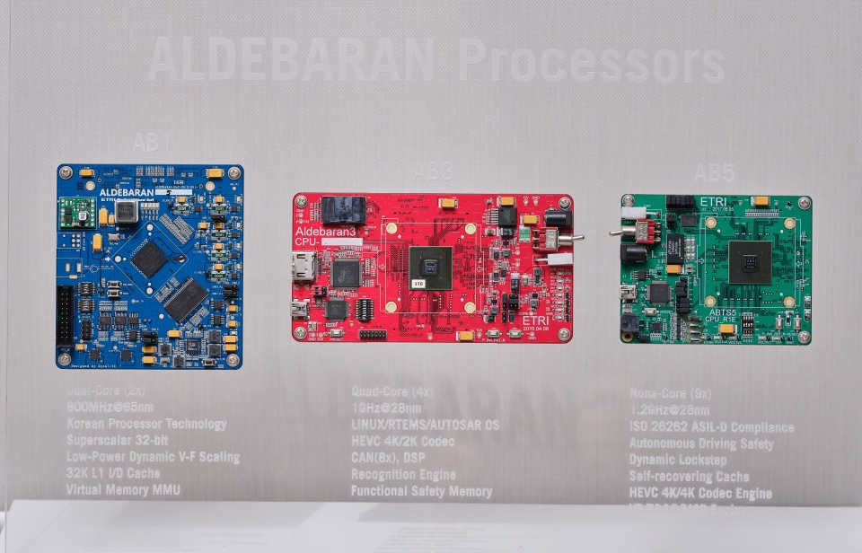
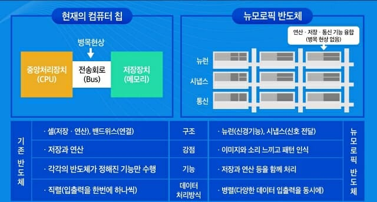

* Since: 2021-01-05 (Tue)

# Neural Processing Unit (NPU)

[ETRI, CES 2021에서 인공지능 칩, 홀로그램, 센서 등 미래 선도형 기술 소개한다](http://www.aitimes.kr/news/articleView.html?idxno=18901), 2021-01-11, AI Times

- 인공지능 반도체 기술은 인공지능 알고리즘의 복잡한 연산 처리에 최적화된 칩 개발 기술
- ETRI의 AI칩은 40테라플롭스(TFLOPS) 연산 능력으로 전력 소모는 15와트(W)에 불과
- 기존 GPU칩 대비 고성능과 저전력, 두 마리 토끼를 다 잡은 기술로 평가

  

[AI의 뇌, 신경망 가속칩이 뜬다](https://zdnet.co.kr/view/?no=20201230155651), 2021-01-03, ZDNet Korea

- 신경망 가속칩(Neural Processing Unit/Neural Processor)은 AI 처리에 특화된 연산을 CPU보다 훨씬 바르게 수행하며, 전력소모가 적음
- 신경망 가속칩 시장의 연 시장 성장률이 37%로 시장 규모가 2025년에 245억 달러(약 36조원)에 달할 것으로 예상 (리포트링커)
- 장점: 말단(엣지)에서 딥러닝 추론 등 AI처리가 가능-> 클라우드 컴퓨팅 대비 데이터 송수신 지연이 없음 -> 실시간 처리가 필요한 분야에 유리

> 신경망 가속칩은 크게 두 종류로 나눌 수 있다. 먼저 딥러닝이나 추론 등 AI 구현을 위한 각종 연산을 가속하는 칩이다. 비트 수가 서로 다른 자료를 처리하거나, 행렬 곱셈과 덧셈 등 연산을 전담해 전력 소모와 처리 시간을 줄일 수 있다.
>
> 다음으로 AI에 필요한 연산을 가속하는 데 그치지 않고 더 나아가 인간의 뇌세포 자체를 모방해 비슷한 방식으로 작동하는 칩을 들 수 있다. IBM 트루노스(TrueNorth),인텔 로이히(Loihi) 등 일부 제품이 나와 있지만 이를 이용한 상용화 제품은 아직 손에 꼽는다.