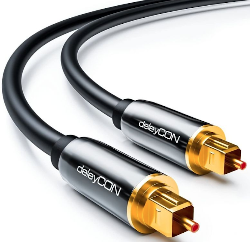

# S/PDIF (Sony/Philips Digital Interface)

출처: [deleyCON Optical Audio Cable S/PDIF 2x Toslink Connectors 10m (black)](https://www.8com.gr/deleycon-optical-audio-cable-s-pdif-2x-toslink-connectors-10m-black)

> 디지털음성을 출력하기 위한 단자입니다. 이 연결방식을 사용하면 스테레오, 돌비 디지털 등의 5.1채널의 사운드 감상을 할 수 있습니다.
> 출처: [SPDIF](https://terms.naver.com/entry.nhn?docId=2464967&cid=51399&categoryId=51399) [네이버 지식백과]  (쇼핑용어사전)

케이블은 광섬유 혹은 코엑셜 케이블이라고 하지만 실제로 광섬유가 많이 쓰입니다.

상세한 내용은 

* [S/PDIF](https://en.wikipedia.org/wiki/S/PDIF), Wikipedia
* [S/PDIF](https://namu.wiki/w/S/PDIF), 나무위키

를 참고하세요.

S/PDIF to S/PDIF

S/PDIF to RCA

출처: [Optical Digital Stereo Audio SPDIF Toslink Coaxial Signal To Analog Converter DAC Jack 2*RCA Amplifi](http://unit808.com/shop/goods_view.php?id=2471537850&ad_code=naver_shopping&NaPm=ct%3Dkjsup4jk%7Cci%3D762885c420667d6f2c130e193e4281d852d2d0f4%7Ctr%3Dslsl%7Csn%3D637611%7Chk%3D157675eb3007d6bfd4181111e9da4bef942e358b)

네이버 검색: 올레tv spdif

* [SPDIF 광케이블 구입 - 올레TV를 5.1채널로 즐기다](https://blog.naver.com/papabear99/220287495338)

