* Draft: 2021-05-21 (Fri)

# YSP Yamaha Sound Projector

## Official Yamah Homepages
[Yamaha Korea](https://kr.yamaha.com/index.html) > [오디오 및 비주얼](https://kr.yamaha.com/ko/products/audio_visual/index.html) > [사운드바](https://kr.yamaha.com/ko/products/audio_visual/sound_bar/index.html)

### Entry-level products
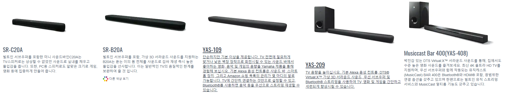

### High-end products


## 관련 블로그
### YSP-5100
* [사운드 프로젝터 경험해보셨나요? (야마하 YSP-5100)](https://brucemoon.net/m/1198141684)
* [야마하 홈시어터 사운드 프로젝터  YSP-5100 시연회](https://m.blog.naver.com/PostView.nhn?blogId=mydecotree&logNo=100115694477&proxyReferer=https:%2F%2Fm.search.naver.com%2Fsearch.naver%3Fsm%3Dmtp_sly.hst%26where%3Dm%26query%3Dysp-5100%26acr%3D1)
* [간편하게 즐기는 홈씨어터의 풍부한 음향, 야마하 사운드 프로젝터 YSP-5100](https://lazion.com/m/2512059)
### YSP-5600
* [사운드바 끝판왕이라는 야마하 YSP-5600 구매기](https://m.blog.naver.com/jsj083011/221177691346)
> 야마하 YSP-1600 이하는 그게 그거다라는 느낌의 글을 접하게 되었습니다. 검색해보니 1600 > 2500 > 3300 > 4600 > 5100 > 5600 점점 높은 숫자들이 보이기 시작하며, 사진상으로 거대해지는 무언가의 포스가 느껴지더군요.

## YSP-5100
### Overview
```
Yamaha's latest Digital Sound Projector provides many new great features like HD Audio decoding, 1080p-compatible HDMI (4 in/1 out), IntelliBeam, numerous listening modes, UniVolume™, AirWired™ technology for iPod/iPhone and subwoofer.

* Includes 40 beam drivers, two woofers and two tweeters with digital amplifiers (120W total power: 2W x 40 + 20W x 2)
* HD Audio format signal capability
* 1080p-compatible HDMI (4 in/ 1 out) with Deep Colour, X.V Colour, Auto Lip-Sync and CEC functionality
* IntelliBeam Automated System Calibration
* Versatile listening modes: 5 BeamPlus2, Stereo + 3 BeamPlus2, 5 Beam, Stereo + 3 Beam, 3 Beam and Stereo.
* Analogue video to HDMI digital video upconversion
* 11 CINEMA DSP programmes: Three Movie, three Music and five Entertainment
* UniVolume
* AirWired technology for wireless operation
* Adaptive DRC, Music Enhancer and Bass Extension
* Custom installation with IR in, IR pass through out, Extended IR and RS-232C interface
* Dimensions (W x H x D): 1,200 x 212 x 90 mm
```
### Specs
| Beam Drivers                                | 4cm x 40 beam drivers + 2.5cm x 2 balanced-dome tweeters     |
| :------------------------------------------ | :----------------------------------------------------------- |
| Woofers                                     | 11cm x 2 woofers                                             |
| Digital Amplifier                           | 120 W total power:2W x 40 beam drivers + 20W x 2 (woofer + tweeters) |
| IntelliBeam                                 | Yes                                                          |
| On-Screen Display                           | Yes                                                          |
| On-Screen Display Languages                 | En/Fr/Ge/Sp/It/Du/Ru                                         |
| Listening Mode                              |                                                              |
| 5 BeamPlus2                                 | Yes                                                          |
| Stereo + 3 BeamPlus2                        | Yes                                                          |
| Stereo + 3 Beam                             | Yes                                                          |
| 5 Beam                                      | Yes                                                          |
| 3 Beam                                      | Yes                                                          |
| Stereo                                      | Yes                                                          |
| CINEMA DSP                                  |                                                              |
| Movie                                       | three Movie                                                  |
| Music                                       | three Music                                                  |
| Entertainment                               | five Entertainment                                           |
| HDMI Interface                              | 4 In/1 Out (1080p)                                           |
| FM Tuner Built-in                           | Yes                                                          |
| iPod Compatibility via Wireless Transmitter | Yes                                                          |
| Wireless Subwoofer Compatibility            | Yes                                                          |
| UniVolume                                   | Yes                                                          |
| Compressed Music Enhancer                   | Yes                                                          |
| Optional Wall Hanging Bracket               | SPM-K30                                                      |
| Power Consumption                           | 55W                                                          |
| Standby Power Consumption                   | 0.5 W                                                        |
| Dimensions (W x H x D)                      | 1200 x 212 x 90 mm                                           |
| Weight                                      | 11 kg                                                        |

* [Product page (Yamaha Europe)](https://europe.yamaha.com/en/products/audio_visual/sound_bar/ysp-5100/downloads.html)
  * [Owner's Manual](https://europe.yamaha.com/files/download/other_assets/5/314405/YSP-5100_4100_om_en2-1.pdf)
  * [Additional Information](https://europe.yamaha.com/files/download/other_assets/1/321381/YSP4100_5100_Additional_Information.pdf)
* [Yamaha YSP-5100, YSP-4100 Reference guide](https://manualzz.com/doc/50950913/yamaha-ysp-5100-quick-reference-guide)
* [Yamaha YSP-5100 Product Broshure)(https://au.yamaha.com/files/download/other_assets/9/317769/YSP-5100_NPB.pdf)

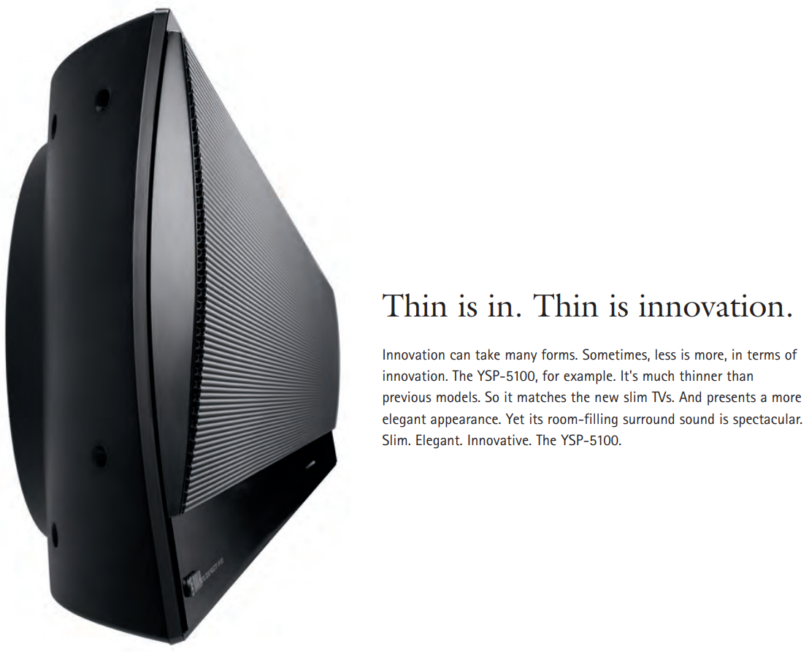

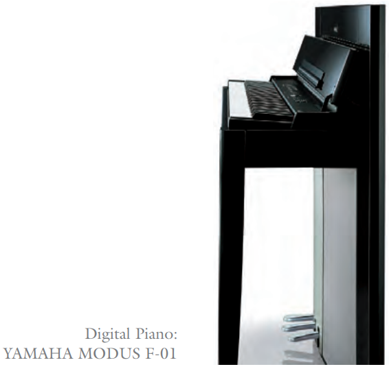


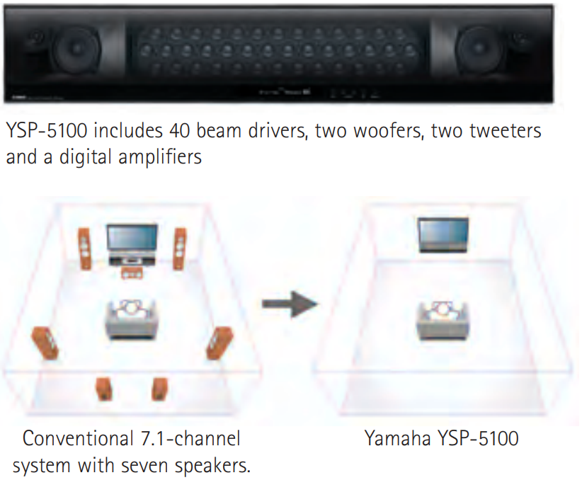

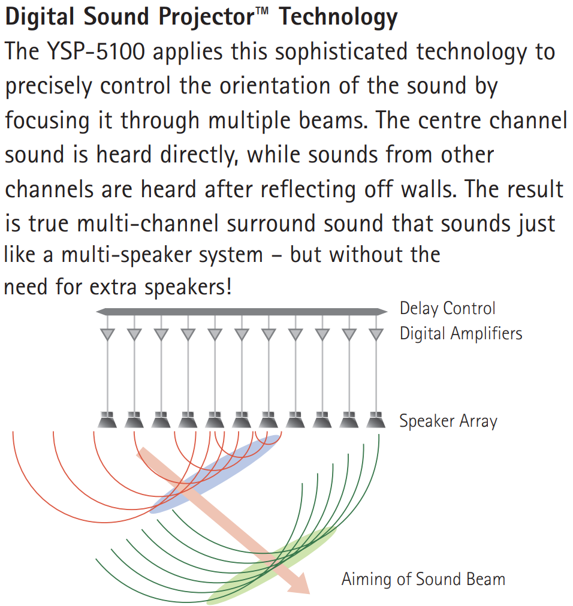


### Accesories
#### [Wireless Subwoofer Kit SWK-W10](https://europe.yamaha.com/en/products/audio_visual/accessories/swk-w10/index.html)
> You can use your AirWired compatible products with an subwoofer without having to connect any cables. The AirWired link transmits uncompressed data (linear PCM) so there is no loss of signal data, unlike systems that use Bluetooth technology to send compressed data. This ensures maximum sound quality.
> 
> * Uses lossless (uncompressed) signal transmission to achieve wireless sound quality
> * Automatic Power on/off
> * [$149.95 (Discontinued)](http://www.thrillingaudio.com/Yamaha_SWK_W10_Accessory_p/yamaha%20swk-w10.htm)

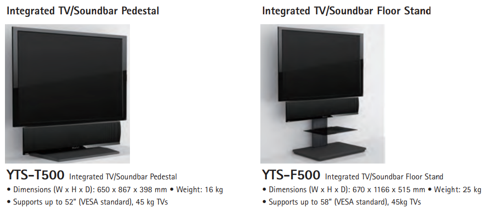

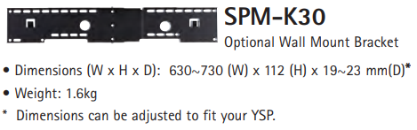

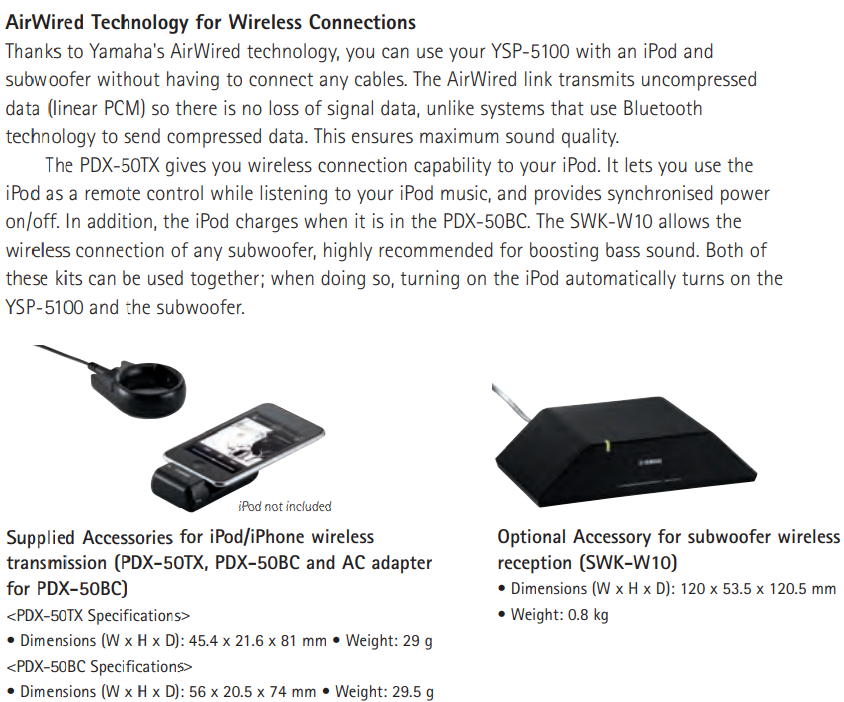

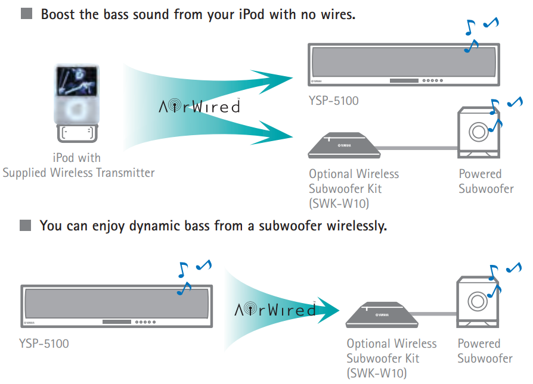


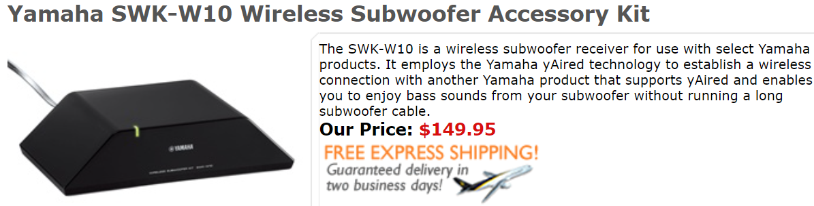

### Owner's Manual

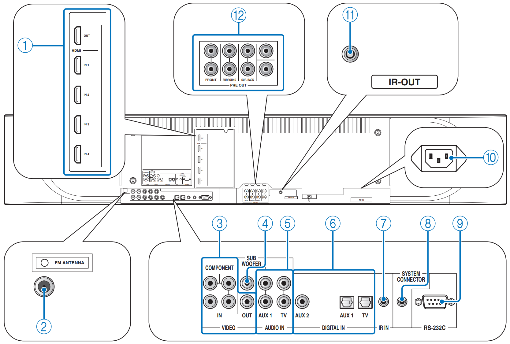
