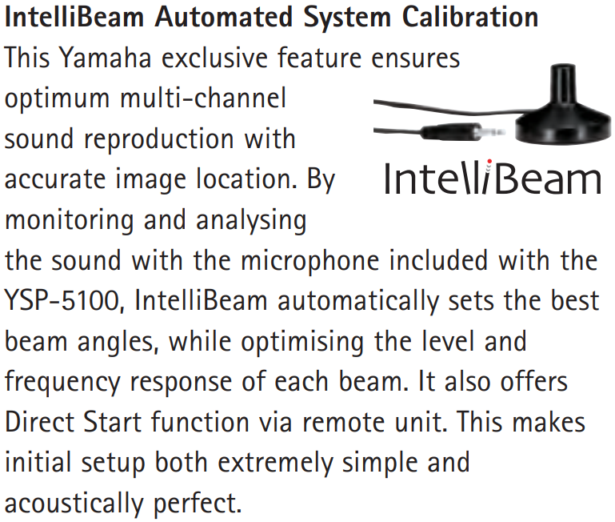
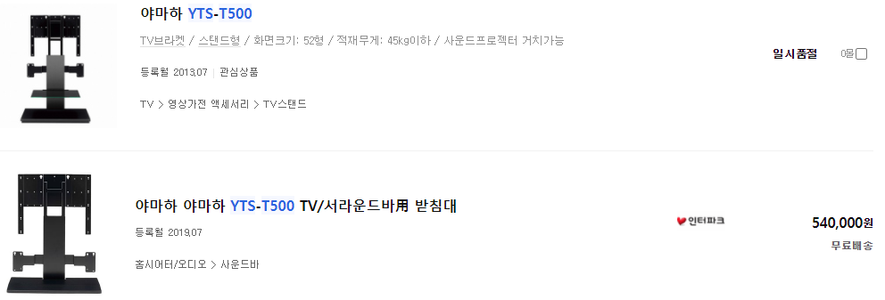

* Draft: 2021-05-21 (Fri)

# YSP Yamaha Sound Projector

## Official Yamah Homepages
[Yamaha Korea](https://kr.yamaha.com/index.html) > [오디오 및 비주얼](https://kr.yamaha.com/ko/products/audio_visual/index.html) > [사운드바](https://kr.yamaha.com/ko/products/audio_visual/sound_bar/index.html)

### Entry-level products

### High-end products

## 관련 블로그
### YSP-5100
* [사운드 프로젝터 경험해보셨나요? (야마하 YSP-5100)](https://brucemoon.net/m/1198141684)
* [야마하 홈시어터 사운드 프로젝터  YSP-5100 시연회](https://m.blog.naver.com/PostView.nhn?blogId=mydecotree&logNo=100115694477&proxyReferer=https:%2F%2Fm.search.naver.com%2Fsearch.naver%3Fsm%3Dmtp_sly.hst%26where%3Dm%26query%3Dysp-5100%26acr%3D1)
* [간편하게 즐기는 홈씨어터의 풍부한 음향, 야마하 사운드 프로젝터 YSP-5100](https://lazion.com/m/2512059)
### YSP-5600
* [사운드바 끝판왕이라는 야마하 YSP-5600 구매기](https://m.blog.naver.com/jsj083011/221177691346)
> 야마하 YSP-1600 이하는 그게 그거다라는 느낌의 글을 접하게 되었습니다. 검색해보니 1600 > 2500 > 3300 > 4600 > 5100 > 5600 점점 높은 숫자들이 보이기 시작하며, 사진상으로 거대해지는 무언가의 포스가 느껴지더군요.

## YSP-5100
* [Yamaha YSP-5100, YSP-4100 Reference guide](https://manualzz.com/doc/50950913/yamaha-ysp-5100-quick-reference-guide)
* [Yamaha YSP-5100 Product Broshure)(https://au.yamaha.com/files/download/other_assets/9/317769/YSP-5100_NPB.pdf)

### Accesories

