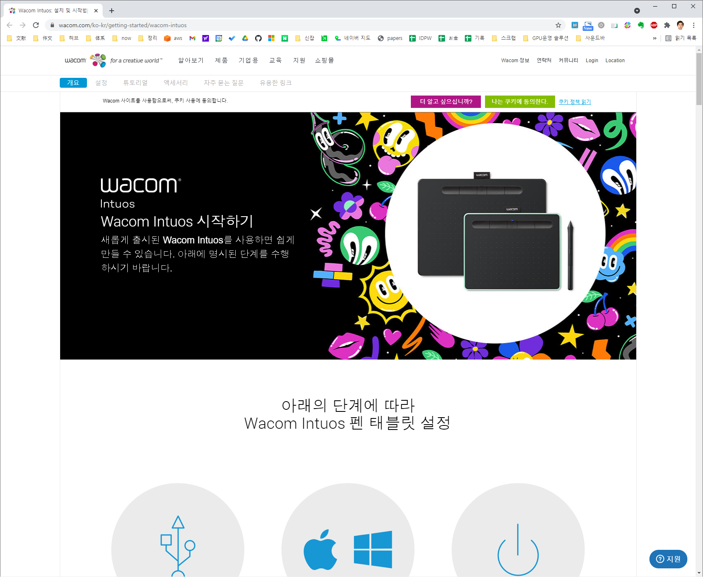
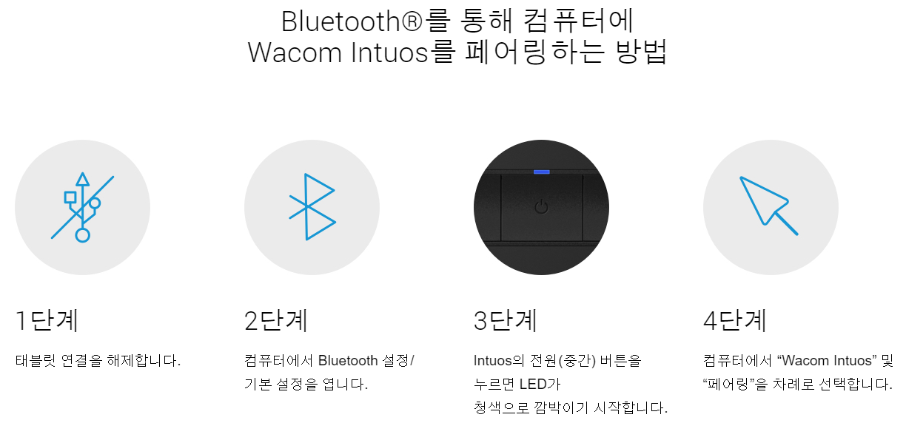
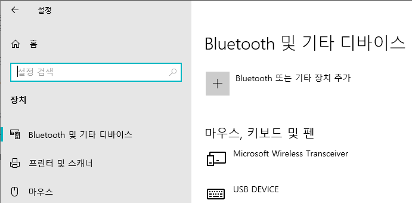
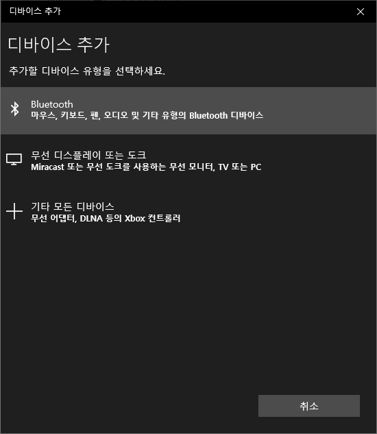
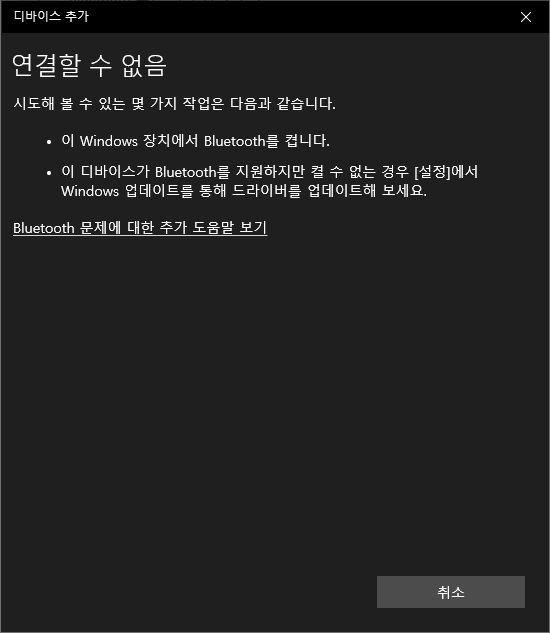

* Draft: 2021-05-16 (Sun)

# 블루투스 설정
* 모델명이 WL로 끝나는 경우 블루투스를 사용할 수 있습니다.
* 이 페이지에서는 (윈도우즈에서) 블루투스 설정에 대해 설명합니다.

## 페어링하는 방법
[Wacom Intuos 시작하기](https://www.wacom.com/ko-kr/getting-started/wacom-intuos) 페이지

의 블루투스 부분의 내용입니다.

* 1단계. 컴퓨터-Intuos가 연결된 USB 케이블을 뺍니다.
* 2단계. 윈도우즈의 `설정 > 장치`로 가면 `Bluetooth 및 기타 디바이스` 메뉴가 기본으로 열립니다.

* 3단계. Intuos의 전원버튼을 누릅니다.
* 4단계. `Bluetooth 및 기타 장치 추가`를 클릭하고 `Bluetooth`를 선택해서 컴퓨터와 Intuos을 페어링합니다.

### 문제 발생

