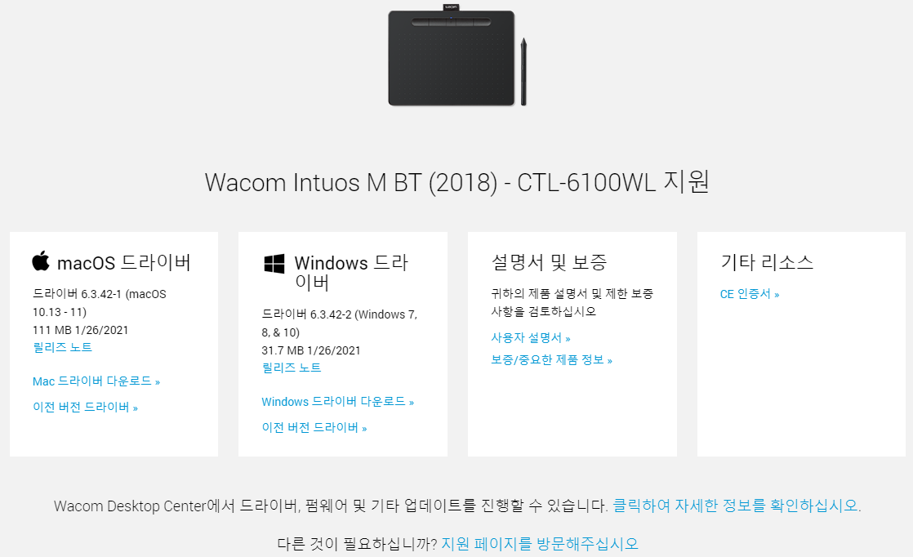

* Draft: 2021-05-16 (Sun)

# 

[드라이버 설치](https://www.wacom.com/ko-kr/support/product-support/drivers)

## 윈도우즈의 경우
* 컴퓨터와 와콤기기를 USB케이블로 직접 연결합니다.
* `Windows 드라이버 다운로드`를 클릭합니다.

* `다운로드를 확인하십시오`를 클릭하면 설치파일이 다운로드 됩니다. 
  * 설치파일의 예 `WacomTablet_6.3.42-2.exe`
* 다운로드된 파일을 실행해서 설치마법사에 따라 설치합니다.
* 컴퓨터를 재시작합니다.
