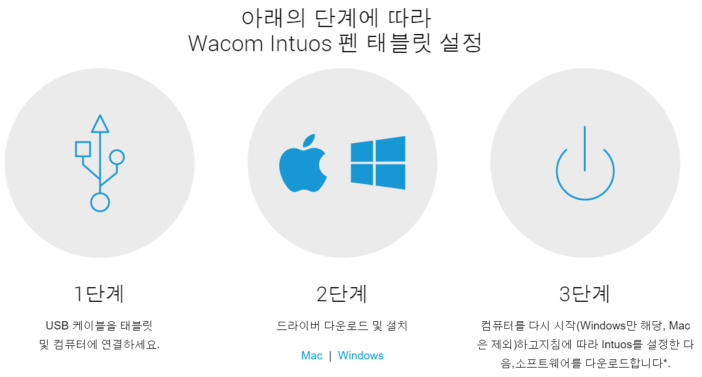
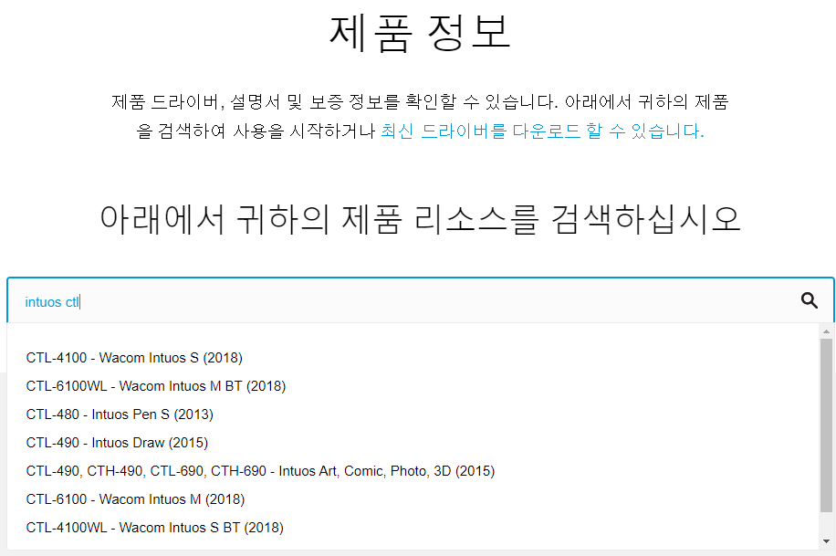
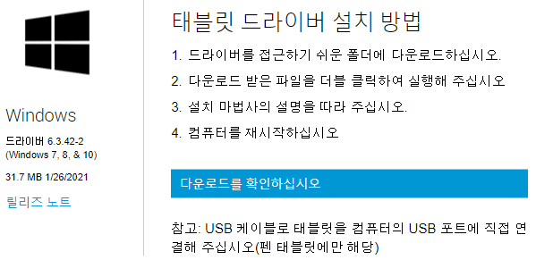
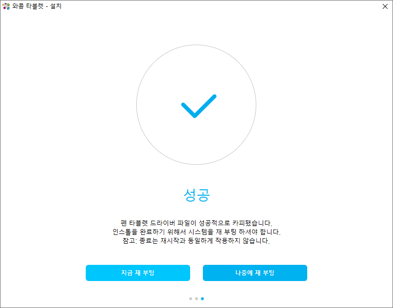
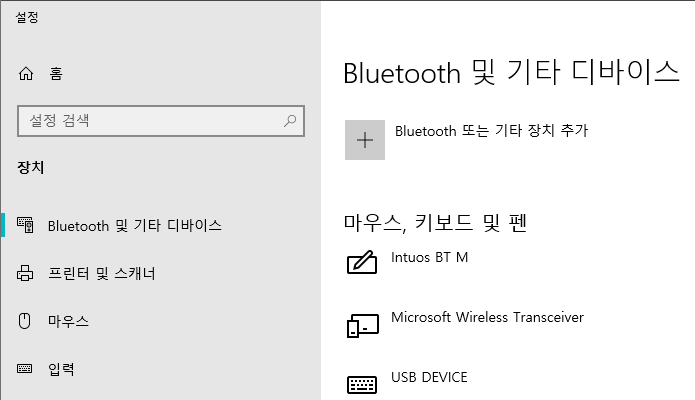
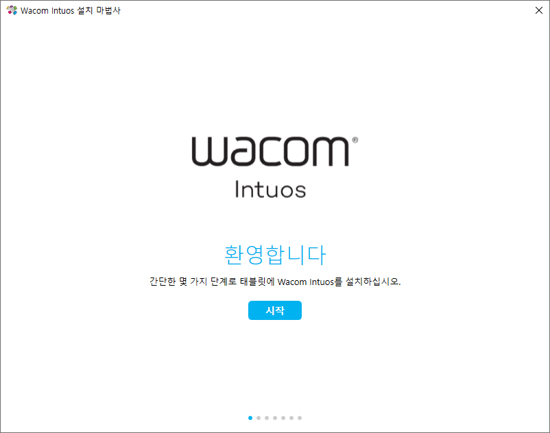

* Draft: 2021-05-16 (Sun)

# 와콤 사용을 위한 설치

* 장치의 올바른 작동을 위해 장치 드라이버가 설치되어야 합니다. 
* 이 페이지에서는 장치 드라이버의 다운로드 및 (윈도우즈용) 설치에 대해 설명합니다.
  * [Wacom Intuos 시작하기](https://www.wacom.com/ko-kr/getting-started/wacom-intuos)에 소개된 설치단계입니다.

## 장치 드라이버 다운로드/설치 방법

네이버로 `wacom`을 검색하면 한국 와콤공색 홈페이지를 찾을 수 있습니다.

* [한국 와콤공식 홈페이지](https://wacomkoreablog.com/?n_media=27758&n_query=WACOM&n_rank=1&n_ad_group=grp-a001-04-000000018112161&n_ad=nad-a001-04-000000132935464&n_keyword_id=nkw-a001-04-000003266985323&n_keyword=WACOM&n_campaign_type=4&n_contract=tct-a001-04-000000000371121&n_ad_group_type=5) > [드라이버 다운로드](https://www.wacom.com/ko-kr/support/product-support/drivers)에서 제품명을 검색합니다.
  * 검색창에 `intuos ctl`를 입력한 후 해당 모델을 클릭하면 손쉽게 드라이버를 찾을 수 있습니다.

* 드라이버 페이지에서 원하는 OS를 선택합니다.

### 윈도우즈의 경우
* 컴퓨터와 와콤기기를 USB케이블로 직접 연결합니다.
* `Windows 드라이버 다운로드`를 클릭합니다.

* `다운로드를 확인하십시오`를 클릭하면 설치파일이 다운로드 됩니다. 
  * 설치파일의 예 `WacomTablet_6.3.42-2.exe`
* 다운로드된 파일을 실행해서 설치마법사에 따라 설치합니다. 설치가 잘 되면 아래처럼 `성공`을 알려줍니다.

* (재부팅도 안 했는데) 설정판에는 다음처럼 `Intuos BT M`이 추가되었음을 알 수 있습니다. 

* 컴퓨터를 재시작합니다.
  * 로그인하면 `Watcom Intuos 설치 마법사`가 `Welcome Intuos` 페이지를 자동으로 런칭합니다.

드라이버의 설치가 완료 되었습니다. `Welcome Intuos` 페이지를 따라 사용법과 블루투스 설정법을 배워봅니다.
