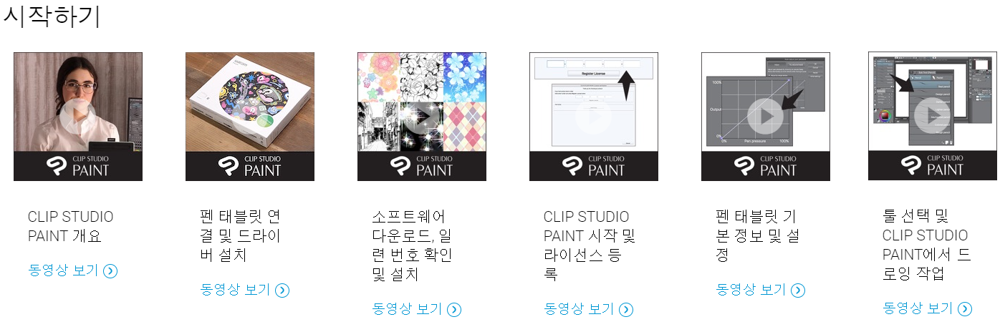
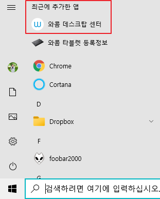
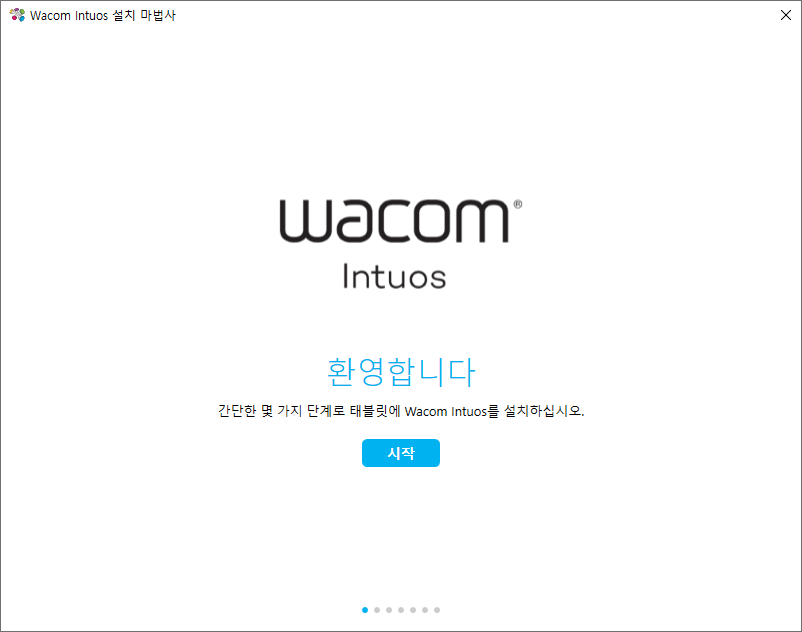

* Draft: 2021-05-16 (Sun)

# 사용방법 빨리 익히기

## [Wacom Intuos 시작하기](https://www.wacom.com/ko-kr/getting-started/wacom-intuos) 내용

### Wacon Desktop Center

* Wacon Desktop Center는 드라이버 설치 시 같이 설치됩니다.

* 실행 시 메인 메뉴입니다.

## `Wacom Intuos 설치 마법사` 내용

