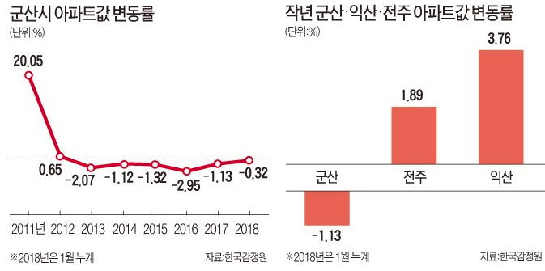

## Survey

### 네이버 검색: 군산 개발 & 네이버 검색: 군산 호재

['새만금 개발 호재' 군산 아파트 202가구 공매 나온다](https://www.hankyung.com/realestate/article/2021011848031), 한국경제, 2021-01-18

> 최근 군산 부동산 시장에 대한 수요자들의 관심이 커지고 있다. 그동안 군산은 2017년 현대중공업 군산조선소 가동 중단과 2018년 한국GM 군산공장 폐쇄 등의 영향으로 지역 경제가 무너지면서 부동산 시장이 얼어붙었다. 신규 분양 아파트 모델하우스에 방문객의 발길이 뚝 끊기고 아파트 거래가 사라지는 등 어려움을 겪기도 했다.
>
> 하지만 2010년 새만금방조제 준공 후 지지부진하던 새만금 개발사업이 본궤도에 오르면서 군산 부동산 경기가 반등했다는 게 일대 중개업소 관계자들의 설명이다. 지난해 새만금 동서도로 개통과 함께 SK컨소시엄이 2조원 규모 투자협약을 맺는 등 각종 개발 호재도 쏟아지고 있다.
>
> 실거래가 역시 상승세다. 한국부동산원에 따르면 군산 아파트값은 2019년 한 해 동안 4.22% 떨어졌지만 지난해 0.58% 상승해 반등에 성공했다.
>
> 군산이 투기과열지구·조정대상지역 등 규제지역에 포함되지 않은 것도 호재다. 정부가 지난달 경기 파주와 충남 천안 등 전국 37곳을 투기과열지구·조정대상지역으로 신규 지정하면서 ‘풍선효과’가 나타나고 있어서다. 비규제지역으로 남은 군산, 경남 창원 마산, 전남 목포 등으로 매수세가 몰리는 모양새다.

> 실거래가 역시 상승세다. 한국부동산원에 따르면 군산 아파트값은 2019년 한 해 동안 4.22% 떨어졌지만 지난해 0.58% 상승해 반등에 성공했다.

에 대한 반론

[별 호재없는 군산부동산 왜 오르나요?](https://cafe.naver.com/astonishiacafe/28024), 군산시닷컴, 2021-01-16, [PDF](pdf_files/별 호재없는 군산부동산 왜 오르나요_ _ 네이버 카페.pdf)

> 요약: 돈이 풀려서 돈의 가치가 떨어지니까 오르는 것처럼 보이는 것이다.

[군산은 호재가 부럽네요](https://cafe.naver.com/astonishiacafe/27692), 군산시닷컴, 2021-01-12, [PDF](pdf_files/군산은 호재가 부럽네요 _ 네이버 카페.pdf)

> 7년동안 이어지는 장기하락이 어느순간 호재가 계속 나오네요. 결국 우상향하는 군산되길.
>
> 댓글
>
> * 현대중공업, 지엠, OCI, 타타대우 등등이 제대로 돌아가던때가 전성기였다고 봅니다. ... SK투자, 새만금수변도시, 군산공항은 착공을 하고 완공을 해야 호재죠
>
>   * 완공까지봐야하는군요
>   * 완공은 재료소멸이죠 ㅋㅋ 보통 호재라 하면 완공 전까지가 호재죠 글쓴분 말씀에 공감합니다.
>
> * 호재로 생각 못하는 이유는
>
>   1. 새만금과 군산은 별개로 인식
>   2. 현대 지엠 등의 큰 대기업 이탈 (새로온다는 곳이 현대보다 클까?)
>   3. 이번년도도 위기고용지역 연장
>   4. 공항,철도, 굳이?라는 의견이 많음
>   5. 태양열 풍력 몇년전에도 엎어졌음
>
>   등등의 이유로 그러는듯 합니다
>
>   * 저도 공감합니다. 중고차단지도 2023년 이후에나 완경이면 정착까지 최소 2년 ㅠ
>
> * 저도 왠만한 도시들 대비 깅버유치 등 큰호재가 제법 있다봐요 ^^ 하지만 실거주 군산원주민분들은 아직도 경기침체가 쭉쭉 될거라 보시더라구요. 이러든저러든 군산 70만도시 된다는 썰도 있던데 그렇게 되길 바라는바 입니다. ^^ 없는게 없는 군산 화리팅~~
>
> * 호재라고 하기엔 풍전등화 아닌가요? ㅋ
>
> * 머가 호재인지 sk2030년이고 군산은 새만큼 개발 안 시키면 지금보다 더 인구도 감소할것이에요 ㅜ
>
>   * 전주가 규제지역으로 묶이니 갑자기 저평가 되어있다 엄청난 호재라고들 하네요
>
> * 가격이 낮은게 호재네요 ㅎㅎ 가격레리트
>
> * 그러게요 부동산 가격만 매력있구! 군산이 발전하면 좋겠지만 성장할 예정만으로는 기약없는 현실이 안타깝네요~ 호재도 악재도 아닌 이 어중간한 상황 ㅠㅠ
>
> * 뉴딜사업 관련해서 여러 기업이 들어오고는 있는데 정상화까지는 시간이 좀 걸리겠죠 ㅠㅠ

### 네이버 검색: 군산 부동산

[새만금 개발로 들떳던 군산 부동산, GM사태로 눈물](https://post.naver.com/viewer/postView.nhn?volumeNo=13232650&memberNo=32662051&vType=VERTICAL), 집코노미, 2018-02-22

> 한국 GM이 군산 공장 폐쇄를 발표하면서 군산 일대 부동산 시장이 얼어붙고 있다. 신규 분양 아파트의 모델하우스에는 방문객들의 발길이 뚝 끊겼고 산업단지 인근 원룸촌에는 빈방이 남아돈다. 입주를 앞둔 아파트 분양권 거래도 전혀 없다. 가계약금을 포기하고 계약을 파기하는 사례도 잇따른다.
>
> 가계약금 포기 줄이어
>
> 아파트값 6년째 추락
>
> 
>
> 올해만 3,500만가구 입주 폭탄

[군산부동산광풍?](https://cafe.naver.com/astonishiacafe/26930), 군산시닷컴, 2021-01-04 [PDF](pdf_files/군산부동산광풍_ _ 네이버 카페.pdf)

> 지금의 사태를 보면서 그간 군산부동산가격이 너무 저평가되었던 것이 아니였는가 조심스레 생각이드네요. 그간 GM 현중이 무너짐에 따라 부동산도 폭락 아닌 폭락이 되었던 것이 사실이였고 이제 좀 제자리를 찾아드나 싶기도 하구요. 좋은 기업들 사람들 많이 유입되어서 더 좋은 군산이 되었음 하네요.
>
> 댓글
>
> * 전국 어디를 다 뒤져도 여기보다 낮은 곳은 없더군요. 너무 저평가에요. 얼른 군산에도 훈풍이 불어오길 기대해봅니다.
>   * 그르게요. 군산은 왠지 낙후된 시골도시 마냥 ^^:: 이제 좀 나아지려나요^^
> * 맞아요. 군산 집값 애기하면 다들 깜짝 놀래요~
> * 저렴한듯
> * 그동안의 고급과잉이 주된 집값하락 이유였죠. 기업문제도 있었지만요. 공급이 적어지니 오르는겁니다.
> * 네~ 앞으로의 공급이 관건이라고 생각합니다.

[군산시, 부동산 투기 합동조사반 운영](https://www.nocutnews.co.kr/news/5475787), 노컷뉴스, 2021-01-05

> * 군산시는 이와 관련해 지난 연말 신규 아파트를 중심으로 아파트 가격이 5천만 원 이상 급등하는 등 이상 현상이 나타나
> * 행정· 사법· 국세합동조사반을 운영. 합동조사반은 군산시와 군산경찰서 군산세무서가 참여하며 불법이 의심되는 신고에 대해 조사

[군산시 "부동산 소유권 이전등기 특별조치 내년 8월까지 시행"](https://www.pressian.com/pages/articles/2021010814171972387?utm_source=naver&utm_medium=search), 프레시안, 2021-01-08

> 전북군산시는 오는 2022년 8월 4일까지 한시적으로 부동산소유권 이전등기 등에 관한 특별조치법이 시행되고 있다고 8일 밝혔다.
>
> 부동산소유권 이전등기 등에 관한 특별조치법은 소유권 보존등기가 되어 있지 않거나 등기부의 기재사항이 실제 권리관계와 일치하지 않는 부동산을 간편한 절차에 따라 등기할 수 있도록 제정됐다.
>
> 적용대상은 읍면 지역은 토지와 건물, 동 지역은 농지와 임야이며 지난 1995년 6월 30일 이전에 매매, 증여, 교환 등 법률행위로 사실상 양도된 부동산 및 상속받은 부동산이 소유권 보존등기 또는 이전등기가 되어있지 않은 경우다. 다만, 소유권에 관한 소송이 진행 중인 부동산과 농지법상 농지를 소유할 수 없는 경우에는 해당되지 않는다.
>
> 등기이전 절차는 부동산 소재지인 각 읍면동리별로 시에서 위촉한 보증인 5명이 사실관계를 확인한 후 보증서에 인감 날인한 보증서를 첨부해 군산시청 토지정보과 와 건축경관과 로 확인서 발급을 신청하면 된다.
>
> 시에서 이해관계인에게 사실통보를 하고 2개월간의 공고를 통해 이의신청이 없을 경우 확인서를 발급하면 법원에 이전등기 신청을 할 수 있다.
>
> 지난해 12월 기준으로 시는 토지 28건, 건물 2건이 접수돼 토지 5건과 건물 1건이 확인서 발급을 받아 등기이전이 완료됐고, 나머지는 공고 등 절차가 진행 중이다.
>
> 시 관계자는 “부동산 소유권이 등기부등본과 달라 재산권 행사에 고통을 겪고 있는 시민들에게 부동산의 권리관계를 바로잡을 수 있는 좋은 기회인 만큼 많은 시민이 혜택을 받을 수 있도록 적극적인 홍보를 하여 지원하겠다.”고 말했다.

[군산지역 재건축 마지막 주자 ‘우진·신남전’어찌되나](http://sjbnews.com/news/news.php?number=703754), 새전북신문, 2021-01-19

* 나운동 재건축 주공2·3단지 순항, 반면 조합원들 불신민원과 운영비 부담 커