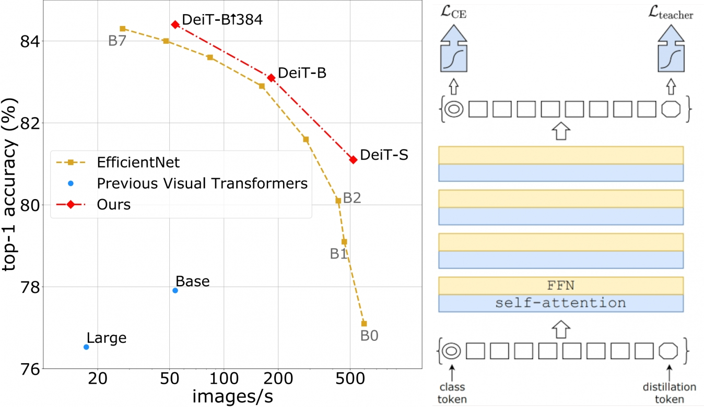

* Since: 2021-01-05 (Tue)

# Facebook

## 페이스북 AI, 이미지 분류 위한 새로운 AI 기술 'DeiT' 오픈 소스로 공개

- DeiT (Data-efficient image Transformers)는 컴퓨터 비전 모델을 기존 방식인 CNN이 아닌 트랜스포머로  훈련시키는 새로운 방식

- (수억 개가 아닌) 120만개의 이미지를 단일-8GPU서버로 3일 훈련해서 ImageNet 벤치마크에서 84.2% Top-1정확도를  달성

- 훨씬 적은 데이터와 컴퓨팅 리소스가 요구되며, 트랜스포머를 컴퓨터 비전에 적용하는 중요한 기술적 진전

- 트랜스포머 구조는 자연어처리 분야에서 최첨단 결과를 냈고, AI 연구 커뮤니티는 이 구조를 컴퓨터 비전 분야에 적용하는 추세

  

- http://www.aitimes.kr/news/articleView.html?idxno=18825
- 2021-01-04, aitimes.kr

> DeiT의 첫 번째 중요한 요소는 학습 전략이다. 페이스북은 처음에 컨볼루션 신경망을 위해 개발된 기존 연구를 기반으로 적응시켰다. 특히, 훨씬 더 큰 데이터 세트에 대한 훈련을 시뮬레이션 하기 위해 데이터 증강 및 최적화를 시켰다.
>
> 마찬가지로 중요한 것은 트랜스포머 아키텍처를 수정하여 네이티브 디스틸레이션(Distillation)을 가능하게 했다. 디스틸레이션은 한개의 신경 네트워크(학생)가 다른 네트워크(교사)의 출력으로부터 학습하는 과정이다. 여기서 CNN을 트랜스포머의 교사 모델로 사용했다. CNN의 아키텍처는 이미지에 대한 더 많은 이전 정보를 가지고 있기 때문에 상대적으로 적은 수의 이미지로 훈련될 수 있다.
>
> 디스틸레이션을 사용하면 신경망의 성능이 저하될 수 있다. 학생 모델은 서로 다른 두 가지 목표를 추구한다. 레이블이 지정된 데이터 세트에서 학습(강력한 감독)과 교사로부터 학습하는 것이다.
>
> 이를 완화하기 위해 변환된 이미지 데이터와 함께 네트워크를 통해 흐르는 학습된 벡터 인 증류 토큰(Distillation Token)을 도입했다. 디스틸레이션 토큰은 모델에 디스틸레이션 출력에 대한 신호를 보내며 이는 클래스 출력과 다를 수 있다. 이 새로운 디스틸레이션 방법은 트랜스포머에만 해당되며 이미지 분류 성능을 더욱 향상시킨다.
>
> DeiT는 소르본 대학(Sorbonne University)의 매튜 코드(Matthieu Cord) 교수와 협력(연구 논문)하여 개발되었다. 페이스북은 현재 코드를 오픈 소스(다운)로 공개했다.
>
> 출처 : [인공지능신문(http://www.aitimes.kr)](http://www.aitimes.kr/news/articleView.html?idxno=18825)