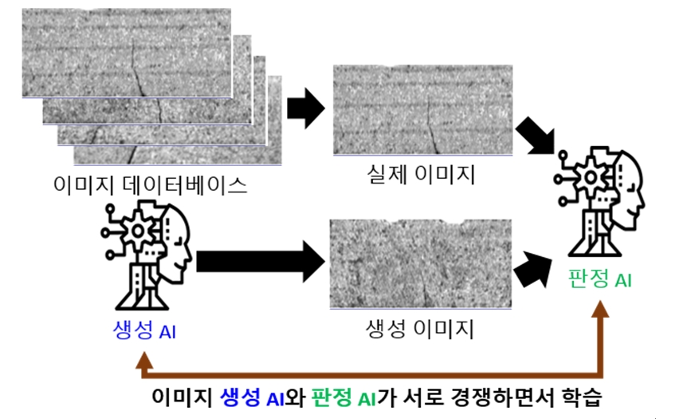
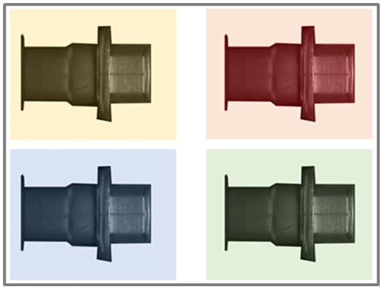

[[기고] 스마트 팩토리에서 인공지능 기반 머신비전과 그 중요성은 무엇인가!](http://www.aitimes.kr/news/articleView.html?idxno=20030), 2021-01-20, AI Times, 김재현 트윔 기업연구소장

* 스마트 팩토리는 인공지능(AI), 빅데이터, 사물인터넷(IoT), 무선통신 등의 기술로 데이터를 연결·수집·분석하는 유연하고 지능적인 공장
  * 컴퓨터와 로봇과 같은 장비를 이용해 생산 과정의 무인화 및 자동화를 추구하는 공장 자동화와 구분
  * 제조 분야별로 특성/운영 방법이 달라 기업의 고유 가치를 반영하도록 스마트 팩토리 구축 방안을 단계별로 수립하고 도입해야 함
* 구축하는데 필요한 여러 분야 중에서 제조공정의 자동화는 아직까지 해결해야 할 일이 많음
  * 제조공정/물류 부문 등에서 컴퓨터/로봇으로 자동화/무인화를  정형화하기 어려운 부문이 있어 사람이 처리함
  * 궁극적인 스마트 공장의 완성을 위해선 이런 부분을 자동화하는 비정형 자동화 기술의 발전이 필요
  * 스마트 팩토리에서 머신비전은 제조 공정에서 사람이 보고 판단하는 작업을 대신 해서 제조 효율성을 높임 (예: 타이어 제품 검사)
* 제조 기업에서 다양한 제품의 생산과정에서 양품/불량품 검사 과정을 거침. 
  * 최근 사람의 육안 검사 대신 머신비전 검사 도입으로 생산성이 높아졌지만 일반 비전검사기의 문제가 발생
  * 작업 환경/검사 기준 수치 변경 시 장비를 새로 세팅해야 하는 번거로움이 있음
  * 다양한 불량 유형/비정형 형태의 불량 유형에서 검사의 정확도가 떨어짐

* 일반적으로 딥러닝 모델을 학습하기 위해서는 일정 수준 이상의 양품과 불량품의 이미지가 필요

  * 양품과 불량품 중 불량품 이미지가 적으면 다양한 방식으로 학습용 이미지를 추가로 생성해서 불량품 이미지를 보충 가능
  * 불량품 이미지를 바탕으로 자동 증분(Augmentation)/이미지 생성(Generative Model) 알고리즘을 적용

  

  * 조명 및 위치 변화에 따른 다수의 이미지 학습 및 분석

  

* 제품 및 제조 현장의 특성상 불량 제품을 얻는 것이 어려운 경우에 제대로 학습할 수 없는 문제점이 있음

  * 이상 탐지(Anomaly Detection) 또는 비지도 학습(Unsupervised Learning, One Class Learning) 으로 이 문제를 해결 가능
  * 정상 제품의 이미지를 학습하여 불량 제품을 분류하면, 불량 이미지 확보 및 라벨링을 위한 노력과 시간을 절약 가능

* 대용량 이미지의 경우 이미지를 크기를 줄여 학습하면 불량 부위에 대한 정보가 왜곡되어 검사 정확도가 떨어지게 됨

  * 전체 이미지를 일정 크기로 분할/관심 영역만 분리해서 학습 및 검사하는 기능이 필요

* 비슷한 제품군에 활용하여 학습시간을 줄일 수 있는 전이학습(Transfer Learning)도 지원이 필요